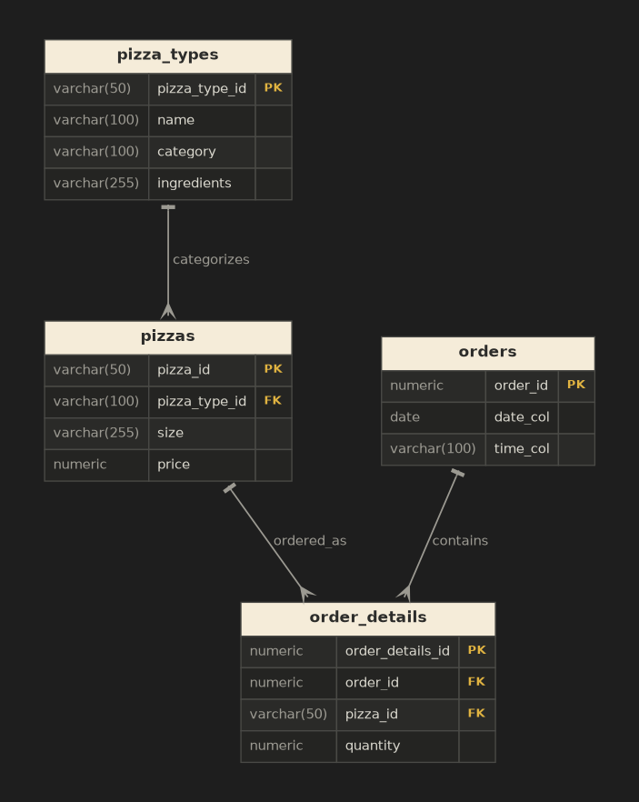

# 🍕 Pizza Sales SQL Analysis

A SQL analytics project that explores a pizza restaurant's sales data to answer business questions ranging from basic aggregations to advanced revenue analysis. Queries are written in SQL and run against a PostgreSQL database (developed in pgAdmin).

---

## Overview

This project uses a relational pizza-sales dataset to answer thirteen business questions, grouped into three difficulty tiers — **Basic**, **Intermediate**, and **Advanced**. Each question is solved with a standalone SQL query covering core concepts such as joins, aggregation, grouping, subqueries, window functions, and running totals.

---

## Database schema

The dataset is spread across four related tables.

| Table | Description | Primary key |
|-------|-------------|-------------|
| `pizza_types` | Catalog of pizza recipes (name, category, ingredients) | `pizza_type_id` |
| `pizzas` | Each sellable size/price variant of a pizza type | `pizza_id` |
| `orders` | One row per order, with date and time | `order_id` |
| `order_details` | Line items linking pizzas to orders with quantity | `order_details_id` |

### Relationships

- `pizza_types` **1 → many** `pizzas` (`pizzas.pizza_type_id → pizza_types.pizza_type_id`)
- `pizzas` **1 → many** `order_details` (`order_details.pizza_id → pizzas.pizza_id`)
- `orders` **1 → many** `order_details` (`order_details.order_id → orders.order_id`)



---

## Questions solved

### 🟢 Basic
1. Retrieve the total number of orders placed.
2. Calculate the total revenue generated from pizza sales.
3. Identify the highest-priced pizza.
4. Identify the most common pizza size ordered.
5. List the top 5 most ordered pizza types along with their quantities.

### 🟡 Intermediate
6. Find the total quantity of each pizza category ordered.
7. Determine the distribution of orders by hour of the day.
8. Find the category-wise distribution of pizzas.
9. Group orders by date and calculate the average number of pizzas ordered per day.
10. Determine the top 3 most ordered pizza types based on revenue.

### 🔴 Advanced
11. Calculate the percentage contribution of each pizza type to total revenue.
12. Analyze the cumulative revenue generated over time.
13. Determine the top 3 most ordered pizza types based on revenue for each pizza category.

---

## Concepts demonstrated

- **Joins** — combining `orders`, `order_details`, `pizzas`, and `pizza_types`
- **Aggregation** — `SUM`, `COUNT`, `AVG`, `ROUND`
- **Grouping & ordering** — `GROUP BY`, `ORDER BY`, `LIMIT`
- **Subqueries** — computing totals for percentage contributions
- **Window functions** — `RANK()`/`ROW_NUMBER()` for per-category rankings and `SUM() OVER (...)` for cumulative revenue
- **String & date functions** — `CONCAT`, `EXTRACT` for hour-of-day distribution

---

## Getting started

### Prerequisites
- PostgreSQL 12+
- A client such as pgAdmin or `psql`

### Setup
```bash
# 1. Create the database
createdb pizza_sales

# 2. Create tables and load the data
psql -d pizza_sales -f schema.sql
psql -d pizza_sales -f data.sql      # or import the CSVs

# 3. Run the analysis queries
psql -d pizza_sales -f queries.sql
```

> Adjust the file names above to match your repository.

---

## Repository structure

```
.
├── README.md
├── pizza_schema.png      # ER diagram of the database
├── schema.sql            # Table definitions
├── data/                 # Source CSV files (pizza_types, pizzas, orders, order_details)
└── queries.sql           # All solution queries, grouped by difficulty
```

---

## Example query

Percentage contribution of each pizza category to total revenue (Question 11):

```sql
SELECT pt.category,
       CONCAT(
         ROUND(
           SUM(p.price * od.quantity)
           / (SELECT SUM(p.price * od.quantity)
                FROM order_details AS od
                JOIN pizzas AS p ON p.pizza_id = od.pizza_id) * 100, 2),
         '%'
       ) AS percentage
FROM pizza_types AS pt
JOIN pizzas AS p        ON pt.pizza_type_id = p.pizza_type_id
JOIN order_details AS od ON od.pizza_id = p.pizza_id
GROUP BY pt.category
ORDER BY percentage DESC;
```

---

## Author

Created as a SQL practice project on pizza sales analysis. Contributions and suggestions welcome.
